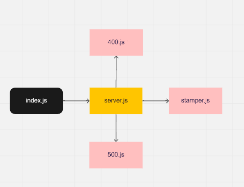

# server-deployment-practice
## Setup :
- .env /PORT=3000
  
## Test :
- npm run test

## Running the app:
- npm run dev

## Deployment Test :
- Heroku (dev) : https://essam-server-deploy-dev.herokuapp.com/ 
- Heroku (main) : https://essam-server-deploy-prod.herokuapp.com/
- Backend: https://github.com/essamomar93/server-deployment-practice
-Pull request: https://github.com/essamomar93/server-deployment-practice/pull/1

## Languages :
- javascript

## UML:

